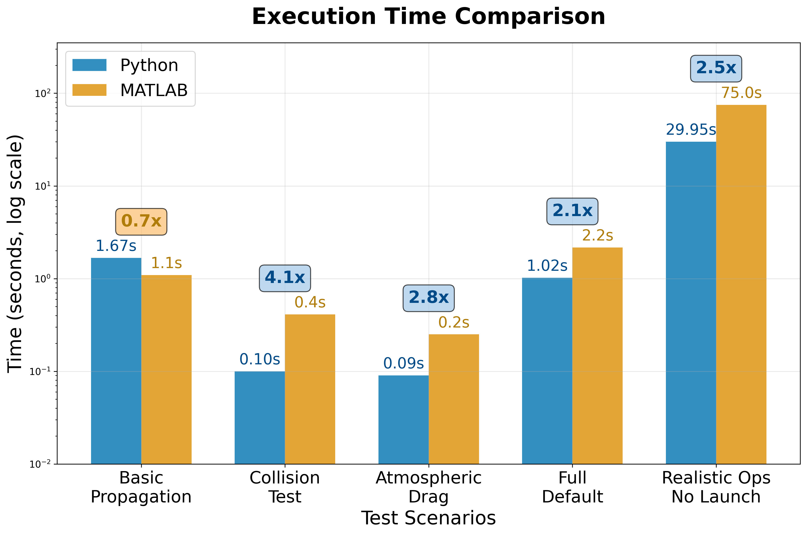
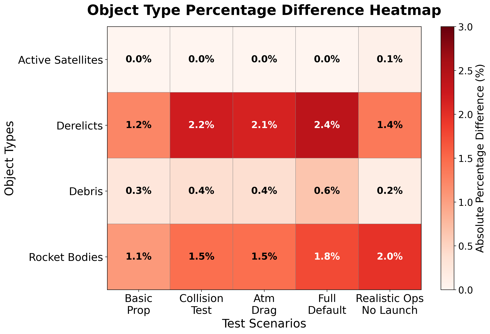
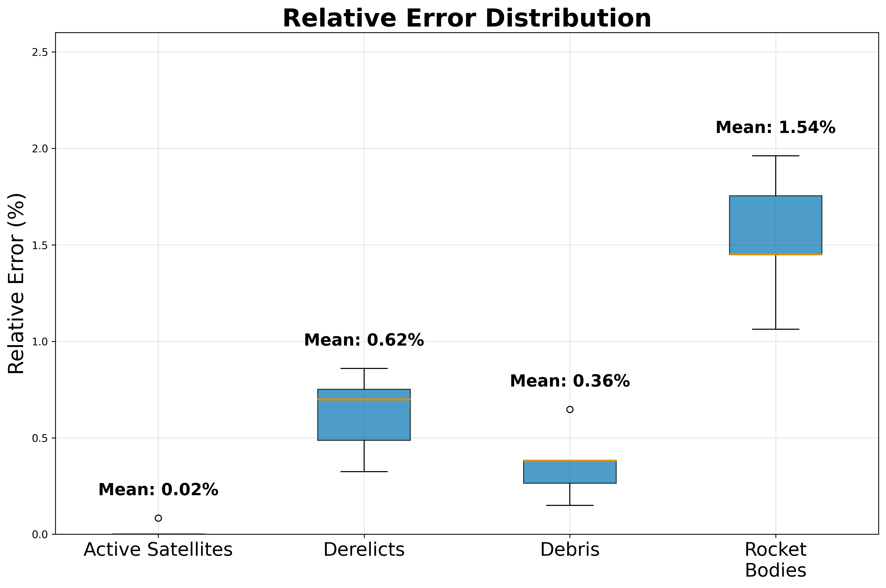

# Summary

The growth of satellite deployments and large-scale constellations has made orbital sustainability an urgent concern [@lewis2020kessler; @bastidavirgili2016constellations; @lemmens2020collision]. Simulating the space environment requires computationally efficient tools compatible with modern research workflows. The MIT Orbital Capacity Assessment Toolbox Monte Carlo module (MOCAT-MC) [@jang2025newmontecarlo] is a leading framework for modeling space traffic and debris risk, but its MATLAB implementation restricts accessibility due to licensing requirements and limits integration with Python-based machine learning and data science workflows.

PyMOCAT-MC is a complete Python reimplementation of MOCAT-MC, maintaining full compatibility while improving performance and accessibility. The translation involves converting over 150 MATLAB functions into Python, preserving core algorithms while restructuring for Python's scientific computing ecosystem. The codebase comprises over 8,600 lines and leverages NumPy, SciPy, pandas, and Matplotlib.

Benchmarking shows PyMOCAT-MC achieves a mean relative error of 0.63% and maximum error of 1.96% across all scenarios. Performance tests demonstrate up to 4× speed gains, with the most demanding scenario completing in 30 seconds versus 75 seconds in MATLAB, enabling more extensive simulation campaigns.

# Statement of need

As the orbital environment becomes more congested [@kukreja2025ghgemissionsleo], modeling collisions and debris evolution has significant implications for policy and engineering. The original MOCAT-MC toolbox [@arclab2025mocatmc] is widely used for Monte Carlo–based orbital capacity assessments, yet its MATLAB implementation limits accessibility for open-source users and hinders integration with Python-based workflows, restricting adoption in the broader space sustainability community.

PyMOCAT-MC addresses these barriers with a functionally equivalent, open-source Python version. The implementation improves runtime performance with a modular design that integrates easily with packages like Astropy, poliastro, and MOCAT-pySSEM [@brownhall2025mocatpySSEM]. The open-source nature supports reproducibility, community contributions, and extensions to new modeling approaches. PyMOCAT-MC fills a unique niche alongside established models like ESA's MASTER [@flegel2012master], offering researchers an accessible, high-performance tool for Monte Carlo-based orbital capacity assessments.

# Methodology

Development began with analysis of the MATLAB source to understand data structures and algorithms. Each function was translated individually, maintaining algorithmic logic while adopting Pythonic conventions. Vectorized operations were introduced to enhance performance without altering results. Atmospheric modeling considerations [@ding2023impactatmosphericmodels; @emmert2015thermodensity] were preserved.

Validation followed a rigorous multi-tiered approach: unit tests verified individual function outputs against MATLAB equivalents, integration tests compared intermediate results at each simulation timestep, and end-to-end validation assessed complete scenario outputs across multiple random seeds. Side-by-side comparisons of orbital element distributions, collision events, and fragmentation patterns ensured differences remained within numerical tolerances (typically < 1%).

The repository includes the main `mocat_mc.py` simulation engine with modules for orbital propagation, collision detection, atmospheric drag, and debris generation. Continuous integration ensures numerical fidelity across benchmark scenarios. Example scripts, comparison tools, and supporting data (historical TLEs, JB2008 atmospheric model, megaconstellation launch schedules) are bundled for immediate use.

# Results

Across all tested scenarios, PyMOCAT-MC reproduces the results of the MATLAB implementation with high fidelity. Testing included five benchmark scenarios (Basic Propagation, Collision Test, Atmospheric Drag, Full Default, and Realistic Operations No Launch) using identical random seeds between implementations to ensure deterministic comparison. All simulations were conducted over 100 years to assess long-term orbital evolution. Differences in final total object counts between the two implementations are small, with a maximum deviation of 123 objects out of approximately 13,700 objects (Full Default scenario after 1 year), representing less than 1% error.

In addition to matching the accuracy of MATLAB, the Python version delivers substantial performance gains (Figure 1). The most computationally demanding scenario, which includes realistic launch patterns for megaconstellations, runs in less than 29.95 seconds with PyMOCAT-MC compared to 75.02 seconds in MATLAB, representing a speed-up larger than a factor of two. These improvements reduce the time required for large simulation batches, enabling exploration of a wider range of parameters and more detailed sensitivity analyses.

{width=80%}

Error analysis confirms that the differences between MATLAB and Python remain minimal across test scenarios and object types. Figure 2 shows that end-of-simulation relative errors are uniformly low across all object types and test scenarios, with a mean relative error of 0.63% and a maximum error of 1.96%. Figure 3 provides additional detail through box plots, demonstrating that errors for active satellites and debris are consistently lower than 0.65%. These sub-1% differences are negligible compared to the variance typically observed between different orbital evolution models [@jang2025newmontecarlo].

{width=80%}

{width=80%}

Figure 4 compares orbital element distributions between MATLAB and Python implementations. Statistical validation using Kolmogorov-Smirnov tests shows excellent agreement (all p-values > 0.05), confirming identical orbital mechanics implementation.

{width=80%}

With this validated accuracy and improved performance, PyMOCAT-MC can be applied to test how different launch strategies influence orbital sustainability, evaluate debris mitigation policies, and generate scenario libraries that inform both engineering design and regulatory decision-making.

# References
