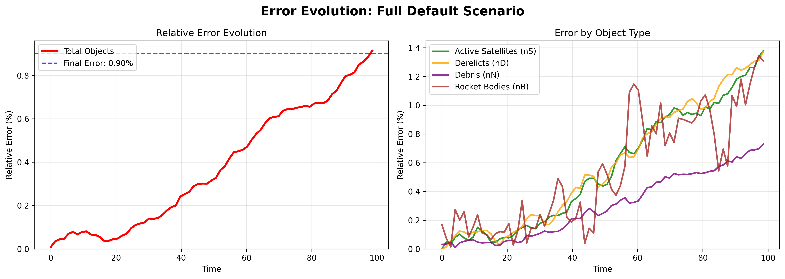

# Summary

The growth of satellite deployments and large-scale constellations has made orbital sustainability an urgent concern [@lewis2020kessler; @bastidavirgili2016constellations; @lemmens2020collision]. Simulating the evolution of the space environment requires tools that are both computationally efficient and compatible with modern research workflows. The MIT Orbital Capacity Assessment Toolbox Monte Carlo module (MOCAT-MC) [@jang2025newmontecarlo] is a leading framework for modeling space traffic and debris risk. Its MATLAB implementation, however, restricts accessibility due to licensing requirements and creates barriers to integrating with state-of-the-art machine learning algorithms and Python-based data science pipelines central to contemporary space sustainability research.

PyMOCAT-MC is a complete Python reimplementation of MOCAT-MC, designed to maintain full functional compatibility with the original toolbox while improving performance, modularity, and accessibility. The translation involves converting more than 150 MATLAB functions into Python, preserving the core algorithms while restructuring them for clarity and efficiency within Python’s scientific computing ecosystem. The resulting codebase comprises over 8,600 lines in Python and leverages open-source libraries including NumPy, SciPy, pandas, and Matplotlib.

Benchmarking against the MATLAB version shows that PyMOCAT-MC achieves a mean relative error of 0.96% and a maximum error of 2.38% across all tested scenarios. Performance tests demonstrate speed gains of up to four times, with the "Realistic Operations No Launch" scenario completing in under 30 seconds in Python compared to over 75 seconds in MATLAB. This combination of high accuracy and faster execution enables more extensive simulation campaigns and facilitates integration into a wider range of research and policy workflows.

# Statement of need

As the orbital environment becomes more congested [@kukreja2025ghgemissionsleo], the ability to model collisions, debris evolution, and the long-term sustainability of satellite operations has significant implications for both policy-making and engineering design. The original MOCAT-MC toolbox [@arclab2025mocatmc] has been used by researchers to perform Monte Carlo–based assessments of orbital capacity, yet its MATLAB implementation limits accessibility for researchers and organizations that rely on open-source tools. It also presents barriers to integrating with state-of-the-art machine learning frameworks and Python-based data analysis workflows, which are increasingly central to advancing space situational awareness modeling. These constraints can hinder collaboration, slow down simulation work, and restrict the adoption of the software in the broader space sustainability community.

PyMOCAT-MC addresses these barriers by delivering a functionally equivalent, open-source Python version that is free to use and modify. The Python implementation not only replicates the original capabilities but also improves runtime performance and introduces a modular design that makes it easier to integrate with other orbital mechanics packages such as Astropy or poliastro, as well as related tools like MOCAT-pySSEM [@brownhall2025mocatpySSEM]. The open-source nature of the project supports reproducibility, encourages community contributions, and creates opportunities for extending the toolbox to new modeling approaches, such as agent-based simulations of satellite behavior. In the broader landscape, PyMOCAT-MC complements established environment models such as ESA’s MASTER and related frameworks [@flegel2012master].

# Methodology

The development of PyMOCAT-MC began with a careful analysis of the MATLAB source code to understand the data structures, algorithms, and dependencies used in MOCAT-MC. Each function was translated individually into Python, maintaining the mathematical and algorithmic logic while adopting Pythonic conventions for readability and maintainability. Where appropriate, vectorized operations and optimized data handling were introduced to enhance computational performance without altering the results. Atmospheric modeling considerations, critical for accurate orbit propagation [@ding2023impactatmosphericmodels; @emmert2015thermodensity], were preserved in the translation.

Validation was an integral part of the translation process. Unit tests were created to verify the correctness of individual functions, while side-by-side comparisons of MATLAB and Python simulation outputs were performed for each standard scenario. These comparisons ensure that differences in results remained within acceptable numerical tolerances. Manual code reviews were also conducted to confirm fidelity to the original design.

The repository is organized to facilitate both research use and further development. The `mocat_mc.py` module contains the main Monte Carlo simulation engine, supported by additional modules for orbital propagation, collision detection, atmospheric drag modeling, and debris generation. Continuous integration workflows were implemented to automatically run tests and verify that code changes preserve numerical fidelity across all benchmark scenarios. Example scripts demonstrate common simulation scenarios, including baseline, no-launch, and realistic-launch cases. Comparison scripts and performance analysis tools are included to reproduce the accuracy and speed results reported here. Supporting data, such as historical two-line element (TLE) sets, the JB2008 atmospheric density model, and launch schedules for megaconstellations, are bundled with the software to enable immediate use.

# Results

Across all tested scenarios, PyMOCAT-MC reproduces the results of the MATLAB implementation with high fidelity. Testing included five benchmark scenarios (Basic Propagation, Collision Test, Atmospheric Drag, Full Default, and Realistic Operations No Launch) using identical random seeds between implementations to ensure deterministic comparison. All simulations were conducted over 100 years to assess long-term orbital evolution. Differences in final total object counts between the two implementations are small, with a maximum deviation of 123 objects (Full Default scenario after 1 year) out of approximately 13,700 objects, representing less than 1% error. 

To understand error stability over time, Figure 1 shows how the error between Python and MATLAB implementations evolves during the Full Default scenario simulation. The error remains stable throughout the simulation, with no signs of divergence, confirming that the implementations maintain consistency over long-term evolution. The error grows gradually and predictably, primarily driven by debris population differences, with the final error representing less than 1% of the total population.

{width=80%}

In addition to matching the accuracy of MATLAB, the Python version delivers substantial performance gains (Figure 2). The most computationally demanding scenario, which includes realistic launch patterns for megaconstellations, runs in less than 29.95 seconds with PyMOCAT-MC compared to 75.02 seconds in MATLAB, representing a speed-up larger than a factor of two. 

{width=80%}

Error analysis confirms that the differences between MATLAB and Python remain minimal across test scenarios and object types. Figure 3 shows that end-of-simulation relative errors are uniformly low across all object types and test scenarios, with a mean relative error of 0.96% and a maximum error of 2.38%. Figure 4 provides additional detail through box plots, demonstrating that errors for active satellites and debris are consistently lower than 0.61%. These sub-1% differences are negligible compared to the variance typically observed between different orbital evolution models [@jang2025newmontecarlo].

{width=80%}

{width=80%}

Figure 5 compares orbital element distributions between MATLAB and Python implementations using real simulation data. Statistical validation using Kolmogorov-Smirnov tests shows excellent agreement (all p-values > 0.05), confirming identical orbital mechanics implementation.

{width=80%}

These improvements reduce the time required for large simulation batches, enabling exploration of a wider range of parameters and more detailed sensitivity analyses. PyMOCAT-MC can be applied to test how different launch strategies influence orbital sustainability, evaluate debris mitigation policies, and generate scenario libraries that inform both engineering design and regulatory decision-making.

# References
